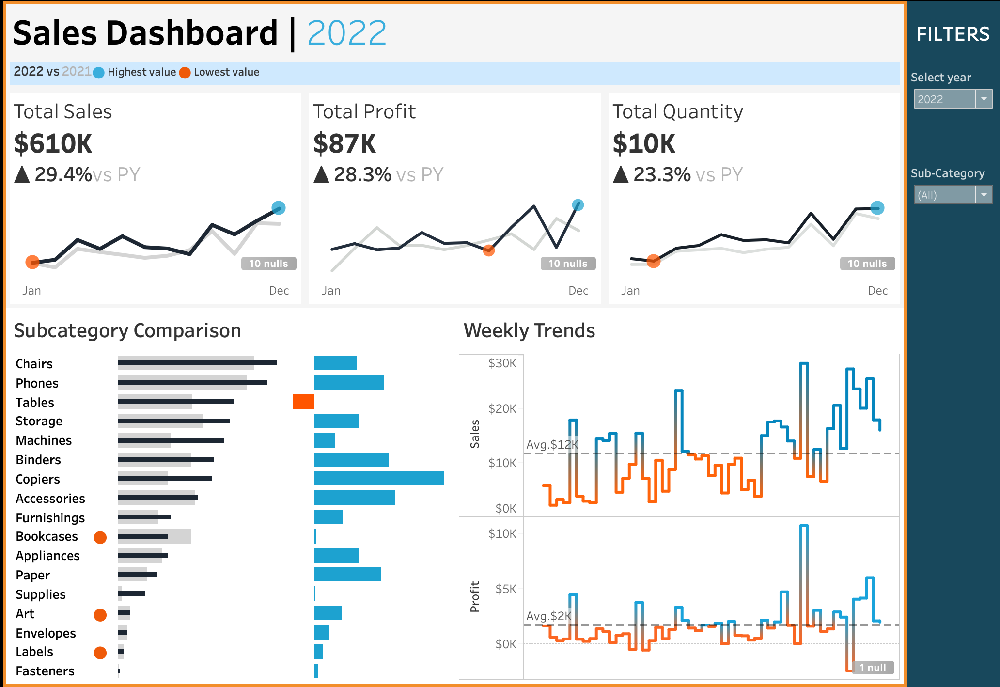

# 📊 Global Superstore Sales Dashboard

An interactive Tableau dashboard designed to analyze sales performance, profitability, and regional trends using the Global Superstore dataset. This project demonstrates my ability to transform raw business data into meaningful visual insights that support data-driven decision-making.

---

## 📸 Dashboard Preview

---

## 🎯 Project Overview

This dashboard provides a comprehensive analysis of the Global Superstore dataset, allowing users to explore sales performance across different regions, product categories, and customer segments. Interactive visualizations make it easy to identify trends, compare performance, and uncover opportunities for business improvement.

The project showcases practical data visualization techniques and demonstrates how Tableau can be used to communicate business insights effectively.

---

## 💼 Business Questions Answered

- Which regions generate the highest sales and profit?
- Which product categories contribute the most to revenue?
- Which customer segments drive the greatest sales?
- Where are profit margins underperforming?
- What trends can help support future business decisions?

---

## 📈 Dashboard Features

- Interactive filters for exploring the data
- Sales and profit analysis
- Regional performance comparison
- Product category analysis
- Customer segment analysis
- Business KPI visualization
- Clear, easy-to-read dashboard layout

---

## 📊 Key Performance Indicators (KPIs)

This dashboard highlights important business metrics, including:

- Total Sales
- Total Profit
- Sales by Region
- Profit by Region
- Sales by Category
- Customer Segment Performance

---

## 🛠️ Tools & Technologies

| Tool | Purpose |
|------|---------|
| Tableau | Dashboard development and data visualization |
| Microsoft Excel | Data preparation |
| GitHub | Version control and project portfolio |
| Markdown | Project documentation |

---

## 💡 Key Insights

- The West region generated the strongest overall sales performance.
- Technology products contributed the highest overall profit.
- The Consumer segment represented the largest share of sales.
- Certain regions generated high revenue but lower profitability, indicating opportunities for operational improvement.

---

## 📂 Repository Contents

- `12345.twbx` — Tableau workbook
- `sales.png` — Dashboard preview
- `README.md` — Project documentation

---

## 🚀 Skills Demonstrated

- Data Visualization
- Dashboard Design
- Business Intelligence
- Data Storytelling
- KPI Development
- Sales Performance Analysis
- Business Insight Generation
- Interactive Dashboard Development

---

## 📚 What I Learned

Through this project, I strengthened my Tableau dashboard development skills by designing interactive visualizations that communicate business insights effectively. I also gained experience presenting analytical findings in a professional format suitable for stakeholders and potential employers.

---

## 🔄 Future Improvements

- Publish the dashboard on Tableau Public
- Connect the dashboard to live data sources
- Add forecasting and trend analysis
- Expand KPI tracking with additional business metrics
- Improve dashboard interactivity with parameters and actions

---

## 👤 Author

**Irene Tran**

Aspiring Data Analyst passionate about transforming data into meaningful business insights through visualization, analytics, and storytelling.

---

⭐ *Thank you for visiting this project! Feedback and suggestions are always welcome.*
